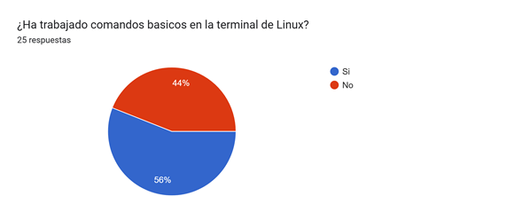
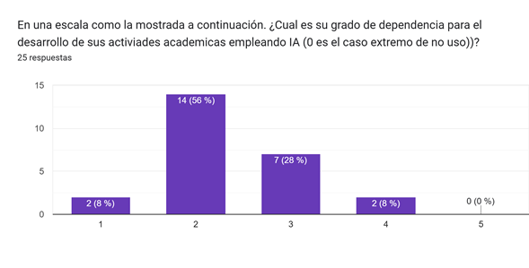
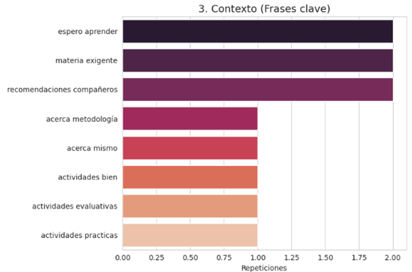
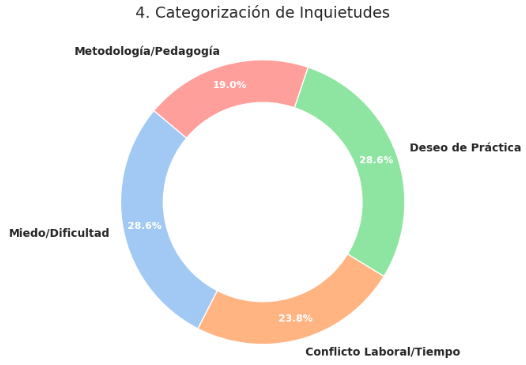

# Reporte de Caracterización: Sistemas Operativos 2026-1 (Ude@)

Este repositorio contiene el análisis detallado del perfil de entrada de los estudiantes. No solo nos enfocamos en qué saben, sino en cómo viven su proceso de aprendizaje y qué esperan de la cátedra.

## 1. Perfil Tecnológico y Demográfico

Antes de entrar en las recomendaciones, el análisis del archivo de caracterización nos arroja una base técnica importante:

|Variable |Estado Predominante |Observación Crítica|
|---|---|---|
|Ubicación|Diversificada (Medellín, Carmen de Viboral, Puerto Berrío, Caucasia)|La conectividad y regionalización son factores clave.|
|Sistema Operativo|Dominio de Windows|La mayoría no tiene Linux nativo; dependeremos de VMs o WSL.|
|Uso de IA|90%+ (ChatGPT, Gemini, Claude)|La IA ya es parte de su flujo de estudio para lógica y errores.|
|Conocimiento de C|Nivel Bajo/Nulo|Existe una brecha técnica inicial que debe ser abordada en la teoria y principalmente el laboratorio.|

A continuación se muestran las graficas de soporte para el caso:

### 1.1. Información regiones

| Seccional | Cantidad |
| :--- | :---: |
| Carmen de Viboral | 8 |
| Medellin | 6 |
| Caucasia | 4 |
| Turbo | 3 |
| Puerto Berrío | 2 |
| Andes | 1 |
| Carepa | 1 |

### 1.2. Uso de Linux

| Sistema Operativo | Cantidad |
| :--- | :---: |
| Linux | 13 |
| Windows | 11 |
| Mac | 1 |

### 1.3. Manejo de consola

| Respuesta | Cantidad |
| :--- | :---: |
| Si | 14 |
| No | 11 |

### 1.4. Programación en C

| Lenguaje C | Cantidad |
| :--- | :---: |
| No | 24 |
| Si | 1 |

### 1.5. Uso de repositorios

| Github | Cantidad |
| :--- | :---: |
| Si | 24 |
| No | 1 |

### 1.6. Uso de IA generativa

| Uso IA | Cantidad |
| :--- | :---: |
| Si | 23 |
| No | 2 |

### 1.7. Plataformas de IA empleadas

| Herramienta IA | Cantidad |
| :--- | :---: |
| ChatGPT | 22 |
| Gemini | 13 |
| Cloude | 10 |
| Perplexity | 1 |
| IA local con Ollama | 1 |
| Qwen | 1 |
| Deepseek | 1 |
| Claude | 1 |
| NotebookLM | 1 |
| (Sin nombre/vacío) | 1 |
| Qrok | 1 |
| Jetbrains IA | 1 |
| Codex | 1 |

### 1.8. Dependencia de la IA en el desarrollo

| Nivel de Dependencia IA | Cantidad |
| :---: | :---: |
| 2 | 14 |
| 3 | 7 |
| 1 | 2 |
| 4 | 2 |

## 2. Visualización de Minería de Texto

A continuación se muestra información relacionada con los comentarios:

### 2.1. Nube de Palabras

### 2.2. Top de palabras

| Palabra | Frecuencia |
| :--- | :---: |
| momento | 6 |
| escuchado | 5 |
| bueno | 4 |
| espero | 4 |
| aprender | 4 |
| tener | 3 |
| horarios | 3 |
| actividades | 3 |
| creo | 3 |
| muchas | 3 |
| clases | 2 |
| ejemplos | 2 |
| entender | 2 |
| solo | 2 |
| lenguajes | 2 |

### 2.3. Top de palabras

| Frase | Frecuencia |
| :--- | :---: |
| espero aprender | 2 |
| materia exigente | 2 |
| recomendaciones compañeros | 2 |
| acerca metodología | 1 |
| acerca mismo | 1 |
| actividades bien | 1 |
| actividades evaluativas | 1 |
| actividades practicas | 1 |
| ademas estaria | 1 |
| adquirir solidos | 1 |

### 2.4. Dona (Categorías)

| Categoría | Menciones |
| :--- | :---: |
| Miedo/Dificultad | 6 |
| Deseo de Práctica | 6 |
| Conflicto Laboral/Tiempo | 5 |
| Metodología/Pedagogía | 4 |

## 3. Hallazgos Principales (Insights)

Tras el análisis, se identifican tres pilares críticos para el semestre:

* **El "Factor Laboral"**: Una parte significativa del grupo trabaja. Solicitan flexibilidad con las grabaciones y las fechas de evaluación para no cruzar responsabilidades.
* **Temor al Lenguaje C**: Existe un respeto (y miedo) generalizado hacia la complejidad de C. El grupo espera una guía docente fuerte y no ser "corchados" por la curva de aprendizaje del lenguaje.
* **Deseo de Modernización**: Hay interés explícito en ver cómo se comparan los conceptos del Kernel con lenguajes modernos como Rust o Go, además de una fuerte demanda por ejemplos prácticos que aterricen la teoría.
* **Entornos Virtualizados**: Dado que el landscape muestra un dominio de Windows, la primera sesión técnica debe garantizar la correcta configuración de WSL2 o Máquinas Virtuales para evitar retrasos en las entregas.

> [!IMPORTANT]
> **Nota de Transparencia:** Este reporte y el análisis de datos fueron generados y adaptados mediante **IA Generativa**. El contenido ha sido supervisado, validado y refinado por intervención humana para garantizar su precisión técnica y coherencia pedagógica. No obstante, pueden haber errores.