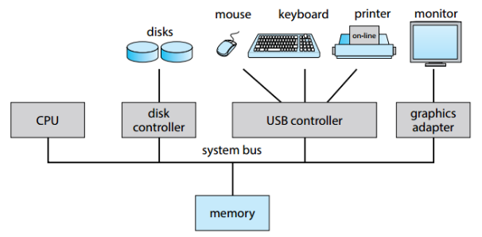
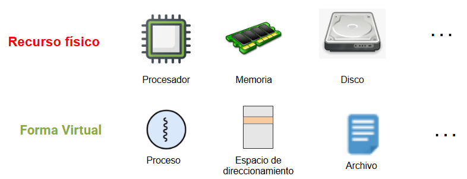
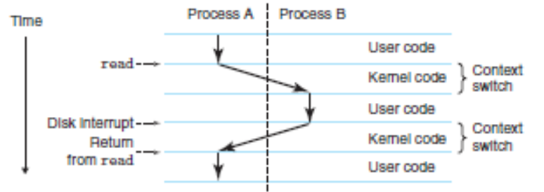
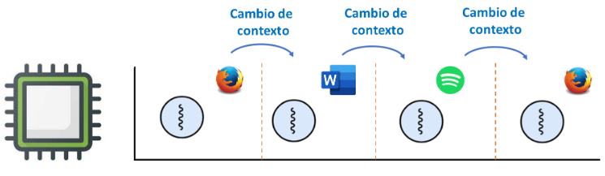
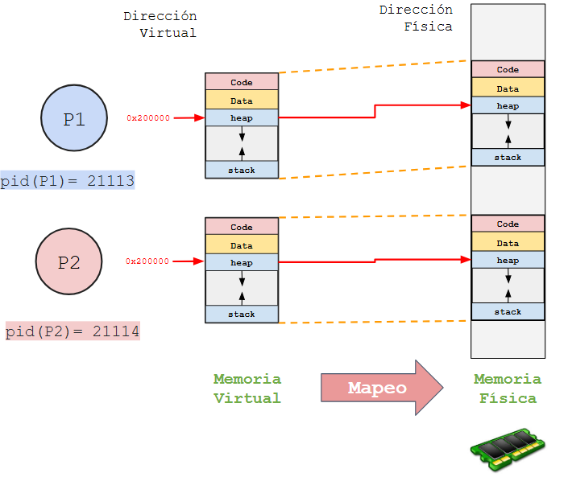
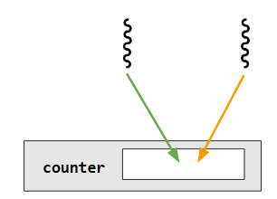

# Notas de Estudio: Introducción a los Sistemas Operativos - Clase 2


> [!IMPORTANT]
> Los codigos aqui empleados son tomados del siguiente [link](https://github.com/remzi-arpacidusseau/ostep-code/tree/master/intro)

---

## 1. El Rol del Sistema Operativo (La visión profunda)



Más allá de ser un "intermediario", en este nivel debemos ver al SO desde tres perspectivas arquitectónicas:

1. **Como Virtualizador (The Virtualizer):**
   
   > **Concepto:** Transforma recursos físicos limitados (CPU, RAM, Disco) en abstracciones virtuales ilusoriamente infinitas, potentes y fáciles de usar.
   
   *Ejemplo:* Un proceso cree que tiene toda la CPU para él, aunque la comparta con otros 100 procesos.   

   

2. **Como Gestor de Recursos (Resource Manager):**
   
   > **Concepto:** Decide quién obtiene qué recurso, cuándo y por cuánto tiempo. Aquí entran en juego las **políticas** (fairness vs. efficiency).
   
   *Conflicto:* Si dos procesos quieren escribir en el mismo bloque de disco al mismo tiempo, el SO arbitra.

   

3. **Como Librería Estándar (Standard Library):**
  
   > **Concepto:** Expone una API (System Calls) para que las aplicaciones interactúen con el hardware sin conocer sus detalles físicos (ej. `open()`, `write()`, `fork()`).
   
   
  
### La Jerarquía de Ejecución

Recuerde el ciclo de instrucción básico (**Fetch-Decode-Execute**) visto en *Arquitectura de Computadores*. El SO no rompe este ciclo, se inserta en él mediante mecanismos de hardware (interrupciones y trampas) para retomar el control.


---

## 2. Virtualización de la CPU

> **La Ilusión:** El sistema tiene un número infinito de procesadores virtuales.


### ¿Cómo funciona? (Time Sharing)

El SO utiliza una técnica llamada **Time Sharing** (tiempo compartido). Ejecuta un proceso por un breve lapso, lo detiene, guarda su estado (context switch) y ejecuta otro.



* **Costo:** Se sacrifica rendimiento bruto (overhead del cambio de contexto) a cambio de la ilusión de multitarea.

### Snippet de Código: `cpu.c`

Este código demuestra que, aunque solo tengas 1 CPU física, varios procesos corren "a la vez".

```c
#include <stdio.h>
#include <stdlib.h>
#include <sys/time.h>
#include <sys/stat.h>

double getTime() {
    struct timeval t;
    gettimeofday(&t, NULL);
    return (double) t.tv_sec + (double) t.tv_usec/1e6;
}

void wait(int howlong) {
    double t = getTime();
    while ((getTime() - t) < (double) howlong)
      ; //wait...
}

int main(int argc, char *argv[])
{
    char *str = argv[1]; //string we passed

    while (1) {
      printf("%s\n", str);
      wait(5);
    }
    return 0;
}
```

#### Comportamiento observado

* **Ejecución del proceso sin paso de parametros**
    
    ```
    prompt> ./cpu
    Segmentation fault (core dumped)
    ```

* **Ejecución un proceso pasando un parametro**
    
    ```
    prompt> ./cpu A
    A
    A
    A
    ^C
    ```

* **Ejecución un proceso pasando un parametro en background**
    
    ```
    prompt> ./cpu A
    A
    A
    A
    ^C
    A
    A
    prompt> pkill cpu
    [1]+  Terminated              ./cpu A
    ```

* **Ejecución de varios procesos en background**

    ```
    prompt> ./cpu A & ./cpu B &
    [1] 193
    [2] 194
    B
    A
    B
    A
    B
    A
    B
    ^C
    A
    B
    prompt> pkill cpu
    [1]-  Terminated              ./cpu A
    [2]+  Terminated              ./cpu B
    ```

---

## 3. Virtualización de la Memoria

**La Ilusión:** Cada proceso cree que tiene toda la memoria física disponible para sí mismo (su propio **Address Space**), desde la dirección 0 hasta el máximo.


### El Problema de la Dirección Física vs. Virtual

En realidad, la memoria física es un arreglo compartido de bytes. El SO mapea las **direcciones virtuales** (las que ve el puntero en C) a **direcciones físicas** reales.

* **Aislamiento (Isolation):** Un proceso no puede leer/escribir en la memoria de otro. Si lo intenta, el hardware lanza una excepción (Segmentation Fault) y el SO mata el proceso.

### Snippet de Código: `mem.c`

Muestra cómo dos procesos independientes pueden tener la **misma** dirección de memoria virtual apuntando a datos diferentes físicos.

```c
#include <unistd.h>
#include <stdio.h>
#include <stdlib.h>
#include <sys/time.h>
#include <sys/stat.h>

double getTime() {
    struct timeval t;
    gettimeofday(&t, NULL);
    return (double) t.tv_sec + (double) t.tv_usec/1e6;
}

void wait(int howlong) {
    double t = getTime();
    while ((getTime() - t) < (double) howlong)
      ; //wait...
}

int main(int argc, char *argv[]) {
    int *p;
    //allocates memory
    p = malloc(sizeof(int));
    //prints address of memory, inserting 0
    printf("(%d) addr pointed to by p: %p\n", (int) getpid(), p);
    // assign input to address stored in p
    *p = atoi(argv[1]);
    //loop every second and increment address value of p
    while (1) {  
        wait(1);
        *p = *p + 1;
        printf("(%d) value of p: %d\n", getpid(), *p);
    }
    return 0;
}
```

> [!IMPORTANT]
> Antes de ejecutar este ejemplo revise la sección de **Details** del siguiente [link](https://github.com/remzi-arpacidusseau/ostep-code/tree/master/intro) y siga las recomendaciones para la compilación aqui dadas.

**Punto Clave:** Si corres dos instancias de esto, ambas imprimirán la *misma dirección de puntero* (ej. `0x200000`), pero incrementarán contadores independientes. ¡Esa dirección `0x200000` es una mentira del SO!



#### Comportamiento observado

Para detener la aleatorización de memoria se debe realizar un paso de compilación diferente si se emplea WSL. Para esto ejecute los siguientes comandos:

1. **Desactivación a nivel de Kernel (Global en la instancia)**
    ```
    prompt> sudo sysctl -w kernel.randomize_va_space=0
    ```
2. **Compilación "Totalmente Estática"**
   
   ```
   prompt> gcc -O0 -no-pie -static mem.c -o mem
   ```

3. **Verificacion del binario**: Debe salir `ELF 64-bit LSB executable...` o la palabra `statically linked`, si sale `ELF 64-bit LSB pie executable..` esta mal.

    ```
    prompt> file ./mem
    ./mem: ELF 64-bit LSB executable, x86-64, version 1 (SYSV), dynamically linked, interpreter /lib64/ld-linux-x86-64.so.2, BuildID[sha1]=c39e69da5e2e4fdde5d5f42e813f87b8714ad7a3, for GNU/Linux 3.2.0, not stripped
    ```

4. **Ejecute el ejemplo**
   
   * **Ejecución de un solo proceso**:
 
        ```
        prompt> ./mem 1
        (305) addr pointed to by p: 0x4052a0
        (305) value of p: 2
        (305) value of p: 3
        (305) value of p: 4
        (305) value of p: 5
        ^C
        ```
   * **Ejecución de un dos procesos**:
  
        ```
        prompt> ./mem 1 & ./mem 10
        [1] 285
        (285) addr pointed to by p: 0x4052a0
        (286) addr pointed to by p: 0x4052a0
        (285) value of p: 2
        (286) value of p: 11
        (285) value of p: 3
        (286) value of p: 12
        (285) value of p: 4
        (286) value of p: 13
        (285) value of p: 5
        (286) value of p: 14
        ...
        prompt> pkill mem
        [1]+  Terminated              ./mem 1
        ```
---

## 4. Concurrencia (El problema de los hilos)

Cuando múltiples hilos de ejecución operan en el **mismo espacio de memoria**, ocurren problemas de indeterminismo.



### El problema: No-Atomicidad

Una instrucción en C como `counter++` no es atómica. En ensamblador se traduce a tres pasos:

1. `LOAD` (memoria -> registro)
2. `ADD` (incrementar registro)
3. `STORE` (registro -> memoria)

Si ocurre una interrupción de temporizador (timer interrupt) entre el paso 1 y el 3, el estado se corrompe (Race Condition).

### Snippet de Código: `threads.c`

```c
#include <stdio.h>
#include <stdlib.h>
#include <pthread.h>
#include <sys/time.h>
#include <sys/stat.h>


double getTime() {
    struct timeval t;
    gettimeofday(&t, NULL);
    return (double) t.tv_sec + (double) t.tv_usec/1e6;
}

void wait(int howlong) {
    double t = getTime();
    while ((getTime() - t) < (double) howlong)
      ; //wait...
}

volatile int counter = 0; 
int increments;

void *worker(void *arg) {
    int i;
    for (i = 0; i < increments; i++) {
      counter++;
    }
    return NULL;
}

int main(int argc, char *argv[]) {
    increments = atoi(argv[1]);
    pthread_t p1, p2;
  
    //create two threads
    pthread_create(&p1, NULL, worker, NULL); 
    pthread_create(&p2, NULL, worker, NULL);
  
    pthread_join(p1, NULL);
    pthread_join(p2, NULL);
    printf("Final value   : %d\n", counter);
    return 0;
}
```
#### Comportamiento observado

**Resultado esperado vs. Realidad:**

Si `loops = 100000`, se esperaría que el contador final sea `200000`. Sin embargo, a menudo se obtienen valores diferentes como `143012` o `198500`.

```
bash> ./threads
Segmentation fault (core dumped)
```

```
bash> ./threads 100000
Final value   : 131222
```

```
bash> ./threads 100000
Final value   : 124701
```

> [!IMPORTANT]
> **Lección:** Sin primitivas de sincronización (locks, semáforos), la concurrencia lleva a estados inconsistentes.


---

## 5. Persistencia

La memoria (RAM) es volátil. Para mantener datos necesitamos hardware de I/O (Discos duros, SSDs) y software que lo administre (**File System**).

* A diferencia de la CPU y RAM, el SO **no** suele virtualizar un "disco privado" para cada aplicación. En su lugar, comparten un sistema de archivos global.

* **Mecanismo:** `fsync()` o journaling son necesarios porque el SO suele mantener los datos en caché antes de escribirlos físicamente al disco para mejorar el rendimiento. Si la luz se va antes del `write` físico, adiós datos.


### Snippet de Código: `io.c`

Este programa crea un archivo llamado `/tmp/file` y escribe una cadena en él.

```
bash> ./io
```

```
bash> cat /tmp/file
I will persist!
```

---

## 6. Conceptos Técnicos "El por debajo"

Estos son términos que distinguen a un usuario avanzado de un ingeniero:

* **Mode Bit:** Bit en el hardware que define si la CPU está en **Kernel Mode** (todo permitido) o **User Mode** (restringido).
* **System Call (Trap):** Instrucción especial que permite a un programa de usuario saltar controladamente al kernel para pedir un servicio. Cambia el *mode bit* a 1.
* **Return-from-Trap:** Instrucción que devuelve el control al usuario y resetea el *mode bit* a 0.
* **Separación de Mecanismo y Política:**
* **Mecanismo:** ¿Cómo hacemos un cambio de contexto? (Low-level assembly).
* **Política:** ¿A qué proceso le toca ahora? (Algoritmo de Scheduling).

---

## Taller de Estudio: Introducción a los Sistemas Operativos

### I. Definiciones y Conceptos Fundamentales

*Responda brevemente con sus propias palabras.*

1. Defina qué es la **Virtualización** en el contexto de un sistema operativo y explique cómo aplica este concepto a la CPU (Procesador).
   
   ```
   
   ```

2. Explique el concepto de **Persistencia**. ¿Por qué la memoria RAM no es suficiente para almacenar datos a largo plazo y qué rol juega el Sistema de Archivos (*File System*) en esto?

   ```
   
   ```

3. Describa qué es una **Condición de Carrera (*Race Condition*)** y por qué suele ocurrir en programas que utilizan concurrencia (hilos/threads).

   ```
   
   ```

4. ¿Cuál es la diferencia entre una **Política** (*Policy*) y un **Mecanismo** (*Mechanism*) en el diseño de sistemas operativos? Proporcione un ejemplo de cada uno.
   
   ```
   
   ```

### II. Análisis del Funcionamiento Interno ("Under the Hood")

5. **Virtualización de Memoria:** Si dos procesos distintos (Proceso A y Proceso B) imprimen la dirección de memoria de una variable y obtienen exactamente el mismo valor (ej. `0x200000`), ¿están accediendo a la misma ubicación física en la RAM? Explique detalladamente qué está haciendo el sistema operativo.

   ```
   
   ```

6. **Protección y Modo Kernel:**
¿Por qué un programa de usuario no puede escribir directamente en el disco duro o acceder a la memoria de otro proceso? Explique el rol de las **Llamadas al Sistema (*System Calls*)** y la instrucción **Trap** en este proceso.

   ```
   
   ```

### III. Ejercicios de Simulación (Pensamiento Computacional)

7. **Simulación de CPU:** Suponga que tiene un programa `cpu.c` que simplemente imprime una letra ("A", "B", "C") en un bucle infinito cada segundo.
   * Si ejecuta `./cpu A & ./cpu B & ./cpu C &` en una terminal.
   * Describa qué vería en la salida de la consola.
   * Explique cómo es posible este comportamiento si su computador solo tuviera **un** procesador físico.
  
   ```
   
   ```


8. **Simulación de Concurrencia:** Analice el siguiente pseudocódigo de un contador compartido por dos hilos, donde `counter` inicia en 0 y cada hilo lo incrementa `N` veces.

   ```c
   // Hilo 1 y Hilo 2 ejecutan esto:
   for (i = 0; i < N; i++) {
     counter = counter + 1;
   }
   ```

   * Si `N = 1000`, ¿por qué es posible que el valor final de `counter` sea **menor** a 2000?
   * ¿Qué pasos de bajo nivel (instrucciones de máquina) componen la operación `counter = counter + 1` y dónde ocurre el fallo?
   
   ```
   
   ```

### IV. Pregunta de Investigación

9. Investigue y liste tres (3) ejemplos de recursos físicos de un computador y nombre la abstracción virtual que el sistema operativo crea para cada uno de ellos.
   * Recurso Físico 1: ___________  Abstracción: ___________
   * Recurso Físico 2: ___________  Abstracción: ___________
   * Recurso Físico 3: ___________  Abstracción: ___________

## Referencias adicionales

* https://www3.nd.edu/~pbui/teaching/cse.30341.fa24/
* https://www3.nd.edu/~pbui/teaching/cse.20289.sp20/
  * https://www3.nd.edu/~pbui/teaching/cse.20289.sp20/reading08.html
* https://kuleuven-diepenbeek.github.io/osc-course/


> [!IMPORTANT]
> **Nota de Transparencia:** Este documento fue generado y adaptado mediante el uso de **IA Generativa**. El contenido ha sido supervisado, validado y refinado por intervención humana para garantizar su precisión técnica y coherencia pedagógica. No obstante, pueden haber errores.