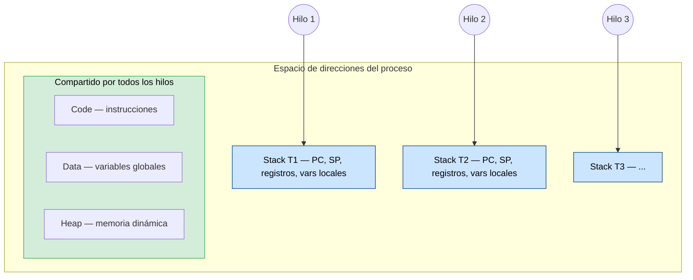
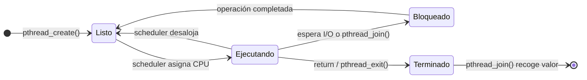
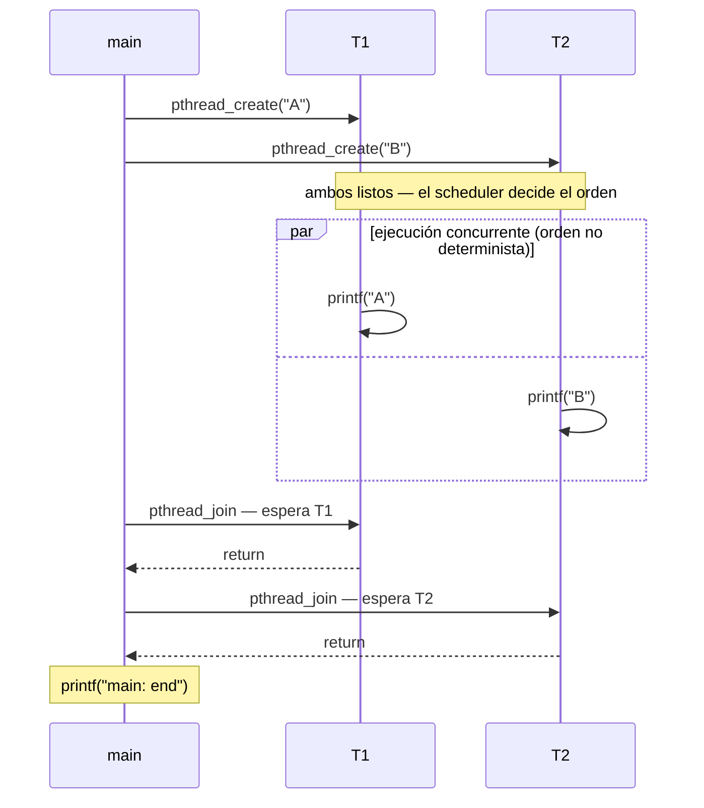
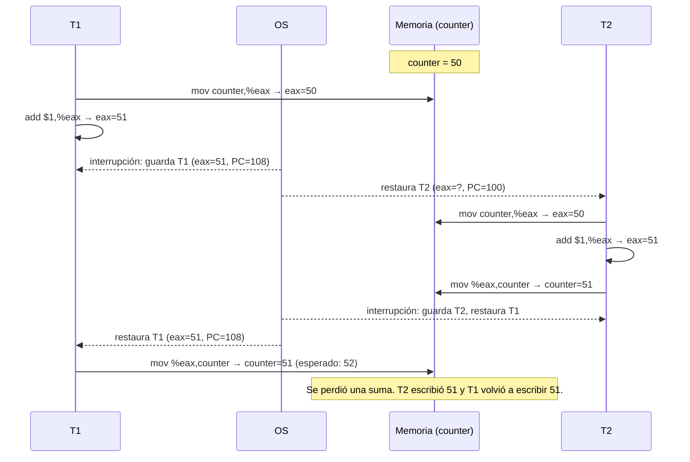

# Sistemas Operativos — Clase 14: Threads

Guía de ejemplos autónoma para estudiantes. Cubre la creación de hilos con la API POSIX (`pthreads`) y su equivalente en Python, el no-determinismo en el orden de ejecución, los datos compartidos y la condición de carrera (*race condition*).

---

## Requisitos

### C

Compilador `gcc` y la librería `pthreads` (incluida en cualquier distribución Linux estándar).

```bash
gcc --version        # debe ser >= 7
```

### Python

Python 3.6 o superior (por el uso de f-strings).

```bash
python3 --version    # debe ser >= 3.6
```

### Verificar `pthreads`

```bash
echo '#include <pthread.h>' | gcc -x c - -lpthread -o /dev/null && echo "OK"
```

---

## Conceptos previos

### Procesos e hilos

Un proceso es la unidad de ejecución clásica del sistema operativo: tiene su propio espacio de direcciones (código, datos, heap y stack), sus registros de CPU y su información de estado. Cuando un proceso tiene un solo hilo, hay exactamente un contador de programa (PC) y un stack: una única secuencia de instrucciones ejecutándose en cada momento.

Un **hilo** (*thread*, hebra, proceso ligero) es una unidad de ejecución dentro de un proceso. Cada hilo tiene lo suyo — su propio PC, su propio stack y su propio conjunto de registros — pero todos los hilos del proceso **comparten** el mismo código, los mismos datos globales y el mismo heap. Esto contrasta con tener múltiples procesos, donde cada uno tiene su propio espacio de direcciones completamente separado.



### Thread Control Block (TCB)

Al igual que el sistema operativo mantiene un PCB (*Process Control Block*) por cada proceso, mantiene un **TCB** por cada hilo. El TCB almacena el PC, el stack pointer (SP) y el resto de los registros del hilo. Cuando el scheduler hace un cambio de contexto entre hilos, guarda los registros del hilo saliente en su TCB y carga los del entrante. A diferencia del cambio de contexto entre procesos, el espacio de direcciones no cambia.

### Ciclo de vida de un hilo



### ¿Por qué usar hilos?

Hay dos razones principales:

**Paralelizar trabajo en sistemas multicore.** Si se deben sumar dos arreglos grandes, se puede asignar la mitad a un hilo y la otra mitad a otro, y ambos corren simultáneamente en núcleos distintos. Un solo proceso secuencial no puede aprovechar más de un núcleo a la vez.

**Superponer cómputo con I/O (overlap).** Mientras un hilo espera que termine una operación de red o disco — que es miles de veces más lenta que la CPU — otro hilo puede seguir trabajando. Esto es la base de los servidores web, bases de datos y cualquier aplicación cliente-servidor.

### Concurrencia vs. paralelismo

Estos dos términos no son sinónimos. **Concurrencia** significa que más de una tarea progresa con el tiempo — en un sistema de un solo núcleo el scheduler las intercala, dando la ilusión de simultaneidad. **Paralelismo** significa que las tareas se ejecutan literalmente al mismo tiempo, en núcleos distintos. Los hilos permiten ambas cosas: concurrencia en un solo núcleo y paralelismo en multicore.

### No-determinismo

Cuando se crean varios hilos, el orden en que el scheduler los ejecuta no está definido por el programa: depende de la carga del sistema, del número de núcleos, de las prioridades y de otros factores externos. Ejecutar el mismo programa dos veces puede producir salidas en distinto orden. Esto no es un bug — es el comportamiento normal y esperado de un programa multihilo sin sincronización explícita.

### Race condition y sección crítica

Cuando dos hilos acceden a una variable compartida y al menos uno de ellos la modifica, puede ocurrir una **condición de carrera** (*race condition*). El problema surge porque una operación aparentemente simple como `counter = counter + 1` no es atómica a nivel de CPU: se expande en al menos tres instrucciones (cargar el valor, incrementarlo, almacenarlo). Si el scheduler interrumpe un hilo entre esas instrucciones y deja correr al otro, ambos pueden leer el mismo valor original y producir un resultado incorrecto.

```
Instrucciones reales de counter = counter + 1:
    mov  0x(...), %eax    ← lee counter en un registro
    add  $0x1,   %eax    ← suma 1
    mov  %eax,   0x(...)  ← escribe de vuelta
```

Si T1 lee `counter = 50`, luego es interrumpido antes de escribir, y T2 también lee `50`, incrementa a `51` y escribe, cuando T1 retoma escribe también `51` — una de las dos actualizaciones se pierde. Al final del día esto equivale al problema de dos cajeros que consultan simultáneamente el saldo de una cuenta bancaria antes de procesar un depósito: ambos ven el saldo original y cada uno lo actualiza por separado, perdiendo una de las dos transacciones.

El fragmento de código donde ocurre el acceso a la variable compartida se llama **sección crítica**. Para protegerla se necesita **exclusión mutua**: garantizar que solo un hilo esté ejecutando esa sección en un momento dado. El mecanismo más común para esto son los *mutex* (`pthread_mutex_lock` / `pthread_mutex_unlock`), que no se cubren en estos ejemplos pero sí en la clase.

### La API POSIX de hilos (`pthreads`)

Las funciones centrales que usan los ejemplos son:

`pthread_create(&tid, NULL, funcion, arg)` — crea un nuevo hilo que empieza ejecutando `funcion(arg)`. El identificador del hilo se guarda en `tid`.

`pthread_join(tid, &retval)` — bloquea al hilo que lo llama hasta que el hilo `tid` termine. El valor de retorno del hilo se deposita en `retval`.

En Python, el módulo `threading` ofrece `Thread(target=f, args=(...))`, `.start()` y `.join()` con la misma semántica.

---

## Organización de los ejemplos

| Archivo | Concepto que ilustra |
|---------|----------------------|
| `t0.c`  | Creación de hilos, `pthread_join`, orden de ejecución no determinista |
| `t0.py` | Equivalente Python de `t0.c` |
| `t1.c`  | Variables compartidas, race condition en un contador global |
| `t1.py` | Equivalente Python de `t1.c` — con nota sobre el GIL |
| `t2.c`  | Paso de `struct` como argumento y retorno de valor desde un hilo vía heap |
| `t2.py` | Equivalente Python de `t2.c` |

---

## Ejemplo 1 — Creación de hilos y orden no determinista (`t0`)

### Contexto

Este ejemplo crea varios hilos independientes que ejecutan la misma función y muestra que el orden en que terminan no está definido. Es el primer contacto con `pthread_create` y `pthread_join`.

El siguiente diagrama muestra el flujo de ejecución. Los dos hilos están listos al mismo tiempo después de los dos `pthread_create` — el bloque `par` indica que corren concurrentemente y el scheduler decide cuál imprime primero:



Una observación importante sobre `t0.c`: el programa crea cinco hilos (p1–p5) pero solo hace `join` explícito de `p5`; los joins de p1–p4 están comentados. Esto significa que `main` no espera que esos cuatro hilos terminen — pueden imprimirse antes, después, o incluso después de `"main: end"`. Es intencional para exagerar el no-determinismo. En un programa real todos los hilos deben tener su `join` correspondiente.

En `t0.py` se crean solo dos hilos con `join` completo — es la versión más limpia del mismo concepto.

### Compilación y ejecución

**C:**
```bash
gcc -o t0 t0.c -lpthread -Wall
./t0
```

**Python:**
```bash
python3 t0.py
```

### Salida esperada

La salida varía entre ejecuciones. Estas son dos salidas reales del mismo binario:

```
main: begin
A C B D E
main: end
```

```
main: begin
A B C D E
main: end
```

En `t0.py` con dos hilos:

```
main: begin
B
A
main: end
```

```
main: begin
A
B
main: end
```

### Por qué el output demuestra el concepto

El orden de las letras cambia porque el scheduler decide qué hilo corre en cada momento. El programa no controla ese orden — solo garantiza (mediante `join`) que `"main: end"` se imprima después de que los hilos con join hayan terminado.

Si en tu máquina siempre ves el mismo orden, ejecuta el binario varias veces seguidas:
```bash
for i in $(seq 1 10); do ./t0; done
```

---

## Ejemplo 2 — Datos compartidos y race condition (`t1`)

### Contexto

Este ejemplo muestra qué ocurre cuando dos hilos incrementan concurrentemente una variable global sin ningún mecanismo de sincronización. El resultado final del contador debería ser `max * 2` (cada hilo suma `max` veces), pero frecuentemente no lo es.

El escenario es idéntico al de dos procesos que intentan incrementar simultáneamente el contador de votos de una elección, o dos hilos de un e-commerce que actualizan el stock de un producto: ambos leen el valor actual, calculan el nuevo valor, y escriben — pero si los dos leen antes de que cualquiera escriba, una de las dos actualizaciones se pierde.

El siguiente diagrama traza exactamente cómo ocurre esa pérdida. El scheduler interrumpe a T1 después de que cargó `counter` en su registro pero antes de que lo escribiera de vuelta. T2 lee el mismo valor original, completa su ciclo, y cuando T1 retoma, sobreescribe el resultado de T2 con su valor obsoleto:



La variable `counter` se declara `volatile` para indicarle al compilador que no la optimice en registros — así cada acceso va a memoria y el race es observable.

**Nota sobre `t1.py` y el GIL:** CPython tiene un *Global Interpreter Lock* (GIL) que serializa la ejecución de bytecodes entre hilos. En la práctica esto hace que la race condition sea difícil de observar en Python con valores pequeños, porque el GIL protege implícitamente muchas operaciones. Con valores muy grandes (`10000000`) puede manifestarse, pero no está garantizado. La versión en C no tiene esa protección y la race es consistentemente reproducible.

### Compilación y ejecución

**C:**
```bash
gcc -o t1 t1.c -lpthread -Wall
./t1 1000000
```

**Python:**
```bash
python3 t1.py 1000000
```

### Salida esperada

Con un valor pequeño (sin race observable):
```
main: begin [counter = 0] [5624A0B12030]
A: begin [addr of i: 0x7f3ec47feeac]
A: done
B: begin [addr of i: 0x7f3ec3ffdeac]
B: done
main: done
 [counter: 20]
 [should: 20]
```

Con un valor grande (race condition activa en C):
```
main: begin [counter = 0] [560C7AFC2030]
A: begin [addr of i: 0x7f1ab47feeac]
B: begin [addr of i: 0x7f1ab3ffdeac]
A: done
B: done
main: done
 [counter: 1414324]
 [should: 2000000]
```

Nótese que `A: begin` y `B: begin` aparecen antes de que cualquiera imprima `done` — ambos hilos están corriendo al mismo tiempo. El resultado `1414324` en vez de `2000000` es la evidencia de actualizaciones perdidas.

En Python con el mismo valor es probable obtener `2000000` (resultado correcto) debido al GIL.

### Por qué el output demuestra el concepto

La diferencia entre el valor obtenido y el esperado cuantifica exactamente cuántas actualizaciones se perdieron por la race condition. La dirección de `i` en cada hilo muestra que cada uno tiene su propio stack (direcciones distintas), mientras que `counter` es una sola dirección compartida — esa asimetría es el origen del problema.

---

## Ejemplo 3 — Argumentos y valores de retorno vía structs (`t2`)

### Contexto

Este ejemplo muestra el patrón correcto para pasar múltiples argumentos a un hilo y recibir múltiples valores de retorno. Como `pthread_create` acepta un único `void *` como argumento y `pthread_join` devuelve un único `void *`, la solución estándar es empaquetar los datos en structs.

El detalle crítico del retorno: la memoria del resultado debe estar en el **heap** (allocada con `malloc`), no en el stack del hilo. Si se retorna un puntero a una variable local del hilo, esa memoria es liberada automáticamente cuando la función termina, y el puntero que recibe `main` apunta a basura. El código incluye un comentario marcando ese anti-patrón.

**Nota sobre `t2.c`:** el archivo contiene un error de transcripción en las líneas de inicialización de `args`:

```c
// Como está (no compila):
args. 10;
args.b = 20;a =

// Debe ser:
args.a = 10;
args.b = 20;
```

Corrige esas dos líneas antes de compilar.

### Compilación y ejecución

**C** (después de corregir el bug de sintaxis):
```bash
gcc -o t2 t2.c -lpthread -Wall
./t2
```

**Python:**
```bash
python3 t2.py
```

### Salida esperada

**C:**
```
10 20
returned 1 2
```

**Python:**
```
10 20
main: result = 1, 2
```

### Por qué el output demuestra el concepto

`10 20` confirma que los argumentos llegaron correctamente al hilo a través del struct. `returned 1 2` confirma que el valor de retorno viajó de vuelta a `main` a través de la memoria heap — si se hubiera usado el stack (anti-patrón), el resultado sería basura o un crash.

En Python el equivalente de pasar un `struct` es una instancia de clase (`MyArg`), y el equivalente de `value_ptr` en `pthread_join` es una lista mutable compartida (`result_container`) donde el hilo deposita su resultado antes de terminar, porque `thread.join()` en Python no retorna el valor del hilo directamente.

---

## Limpieza

```bash
rm -f t0 t1 t2
```

---

## Conclusiones

Los tres ejemplos recorren una cadena de complejidad creciente:

| Mecanismo | Qué resuelve | Qué limitación introduce |
|-----------|--------------|--------------------------|
| `pthread_create` + `pthread_join` | Permite ejecutar tareas en paralelo dentro de un proceso | El orden de ejecución es no determinista |
| Variables globales compartidas | Permite que los hilos se comuniquen sin IPC | El acceso concurrente sin control produce resultados incorrectos (race condition) |
| Structs en heap para args/retorno | Permite pasar y recibir datos complejos entre hilos de forma segura | La gestión manual de memoria (`malloc`/`free`) introduce riesgo de leaks |
| Mutex (`pthread_mutex_lock`) | Protege las secciones críticas garantizando exclusión mutua | Introduce riesgo de deadlock si los locks no se adquieren en orden consistente |

El hilo conductor es que cada solución al problema anterior abre un problema nuevo. Los hilos resuelven el paralelismo, pero exponen los datos compartidos. Los datos compartidos resuelven la comunicación, pero requieren sincronización. La sincronización resuelve la race condition, pero puede causar deadlock. Entender esa cadena es el núcleo de la programación concurrente.

---

## Referencias

**Libro de texto principal:**
- Arpaci-Dusseau, R. & Arpaci-Dusseau, A. *Operating Systems: Three Easy Pieces*. Capítulos 26 (Concurrency: An Introduction), 27 (Thread API) y 28 (Locks). Disponible en: https://pages.wisc.edu/~remzi/OSTEP/

**Documentación de APIs:**
- `pthread_create(3)`, `pthread_join(3)`, `pthread_mutex_lock(3)` — disponibles localmente con `man pthread_create`
- Python `threading` module: https://docs.python.org/3/library/threading.html

**Repositorio de código de referencia (OSTEP):**
- https://github.com/remzi-arpacidusseau/ostep-code/tree/master/threads-api

**Lectura complementaria sobre el GIL de Python:**
- https://docs.python.org/3/glossary.html#term-global-interpreter-lock

---

> [!note]
> **Nota sobre IA:** esta guía fue elaborada con asistencia de un modelo de inteligencia artificial. El código fue compilado y ejecutado para verificar su corrección.