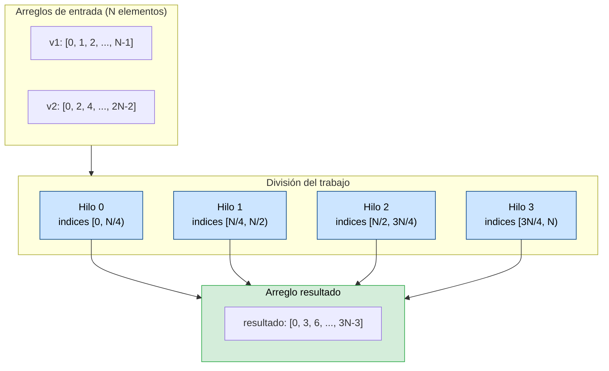
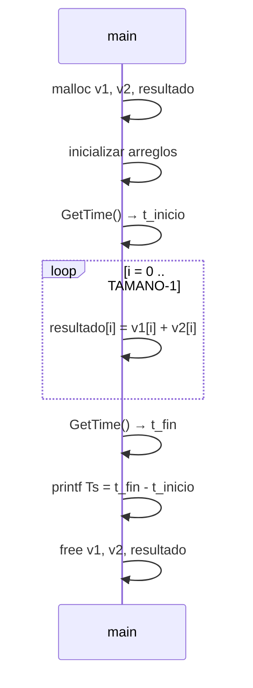
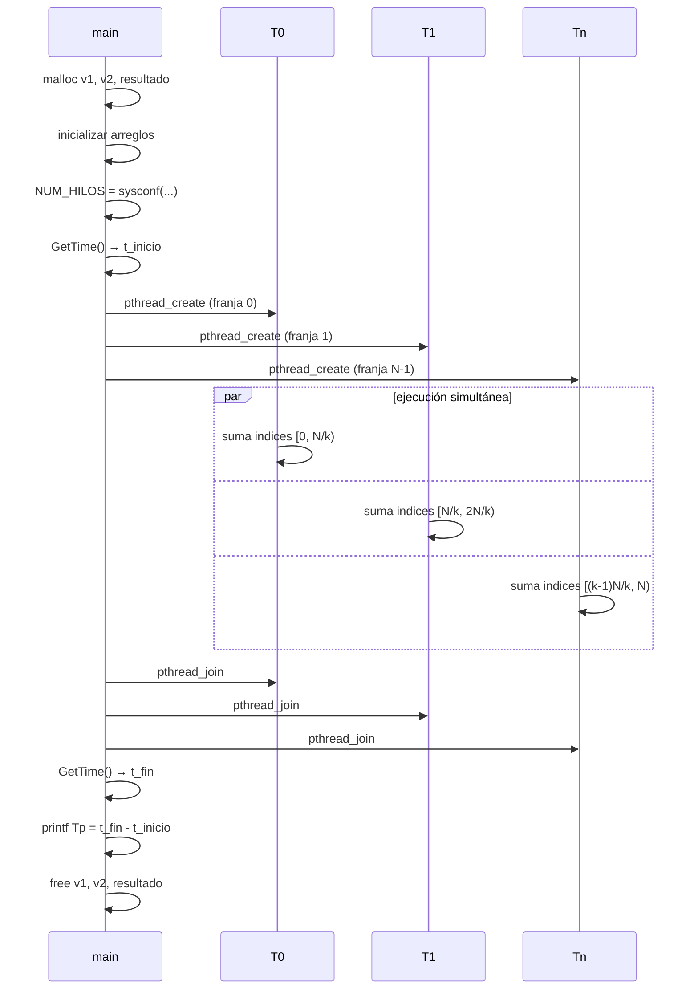

# Sistemas Operativos — Clase 14: Paralelismo de datos

Guía de ejemplos autónoma para estudiantes. Muestra cómo transformar un programa serial que suma dos arreglos grandes en una versión paralela que distribuye el trabajo entre todos los núcleos disponibles, y cómo medir la ganancia de velocidad resultante.

---

## Requisitos

### C y pthreads

```bash
gcc --version       # debe ser >= 7
nproc               # muestra cuántos núcleos tiene tu máquina
```

### Memoria RAM disponible

Cada arreglo de `100_000_000` enteros ocupa ~400 MB. El programa necesita tres arreglos: aproximadamente **1.2 GB libres** para correr con el tamaño por defecto. Si tu máquina tiene 16 GB o más, puedes cambiar `TAMANO` a `1_000_000_000` para amplificar la diferencia de tiempos.

```bash
free -h             # verifica memoria disponible (Linux)
```

### Headers del repositorio

Los archivos `common.h` y `common_threads.h` deben estar en el mismo directorio que los fuentes. Son parte del repositorio de código del libro OSTEP.

---

## Conceptos previos

### Paralelismo de datos

El **paralelismo de datos** consiste en dividir un conjunto grande de datos en subconjuntos independientes y procesar cada subconjunto en un núcleo distinto al mismo tiempo. Es la estrategia natural cuando la misma operación se aplica a todos los elementos y no hay dependencia entre ellos.

La suma de dos arreglos es el caso más limpio posible: `resultado[i] = v1[i] + v2[i]` para cada `i` no depende de ningún otro índice. Esto permite cortar el arreglo en tantas franjas como núcleos tenga la máquina y asignar cada franja a un hilo.



El último hilo recibe también los elementos sobrantes cuando el tamaño del arreglo no es divisible exactamente entre el número de hilos.

### Speedup

El **speedup** es la razón entre el tiempo de la versión serial y el tiempo de la versión paralela:

```
Speedup = Ts / Tp
```

Un speedup de 2 significa que la versión paralela terminó en la mitad del tiempo. En teoría, con N núcleos el speedup máximo es N (speedup lineal). En la práctica siempre es menor por el overhead de crear hilos, la contención de memoria y la parte serial del programa que no se puede paralelizar.

### Cómo se divide el trabajo

Dado un arreglo de `TAMANO` elementos y `NUM_HILOS` hilos, cada hilo recibe una franja contigua:

```
tamano_trozo = TAMANO / NUM_HILOS
inicio = id * tamano_trozo
fin    = inicio + tamano_trozo      // excepto el último hilo
```

El último hilo extiende su `fin` hasta el final del arreglo para absorber el residuo de la división entera. Ejemplo con 10 elementos y 3 hilos:

```
Hilo 0: índices [0, 3)  → 3 elementos
Hilo 1: índices [3, 6)  → 3 elementos
Hilo 2: índices [6, 10) → 4 elementos  ← absorbe el residuo
```

### Detección automática de núcleos

`sysconf(_SC_NPROCESSORS_ONLN)` devuelve el número de núcleos lógicos disponibles en tiempo de ejecución. Esto hace que el programa se adapte automáticamente a la máquina donde corre sin necesidad de recompilar.

### `GetTime()` y medición de tiempos

`GetTime()` (definida en `common.h`) usa `gettimeofday()` y devuelve el tiempo actual como un `double` en segundos con resolución de microsegundos. El patrón de medición es:

```c
double t_inicio = GetTime();
// ... trabajo a medir ...
double tiempo = GetTime() - t_inicio;
```

---

## Organización de los ejemplos

| Archivo        | Concepto que ilustra                                      |
|----------------|-----------------------------------------------------------|
| `suma_s.c`     | Suma serial de arreglos — línea base de tiempo (Ts)       |
| `suma_p.c`     | Suma paralela — división del trabajo por hilos, tiempo Tp |
| `common.h`     | Header OSTEP: `GetTime()` para medición de tiempos        |
| `common_threads.h` | Header OSTEP: wrappers de pthreads (no usado aquí directamente) |

---

## Ejemplo 1 — Suma serial (`suma_s`)

### Contexto

La versión serial establece la **línea base**: un único hilo recorre todo el arreglo de principio a fin. No hay paralelismo, no hay overhead de creación de hilos. Su tiempo de ejecución (Ts) es el denominador del speedup.



### Compilación y ejecución

```bash
gcc -o suma_s suma_s.c -Wall
./suma_s
```

### Salida esperada

```
Ejecutando la suma en modo serial...
Tiempo de ejecución serial (Ts): 2.983059 segundos.
```

El tiempo varía según la máquina y la carga del sistema. Con `TAMANO = 100_000_000` es esperable entre 0.2 y 4 segundos.

### Por qué el output demuestra el concepto

El tiempo medido es puro trabajo de CPU sobre memoria: no hay syscalls, no hay I/O, no hay sincronización. Es la cota inferior de lo que un solo núcleo puede hacer con este problema, y la referencia contra la que se mide toda ganancia paralela.

---

## Ejemplo 2 — Suma paralela (`suma_p`)

### Contexto

La versión paralela crea un hilo por núcleo disponible. Cada hilo recibe en su `thread_args_t` los punteros a los arreglos compartidos y los índices de su franja. Como cada hilo trabaja sobre una porción disjunta del arreglo de resultados, **no hay race condition**: dos hilos nunca escriben en la misma posición.



**Nota sobre `Spin()`:** la función del hilo tiene una línea comentada con `Spin(0.000001)`. Si se descomenta, introduce una pausa artificial por elemento para simular trabajo más pesado (como cálculos costosos). Esto amplifica la diferencia entre la versión serial y la paralela y hace el speedup más dramático y fácil de medir.

### Compilación y ejecución

```bash
gcc -o suma_p suma_p.c -lpthread -Wall
./suma_p
```

### Salida esperada

```
Usando 4 hilos para la suma.
Suma paralela completada.
Tiempo de ejecución (Tp): 0.821 segundos.
```

El número de hilos depende de la máquina. En una máquina de 4 núcleos es esperable un speedup cercano a 4x respecto a `suma_s`.

### Por qué el output demuestra el concepto

La reducción de tiempo respecto a `suma_s` es directamente proporcional al número de núcleos que trabajan en paralelo. El speedup calculado manualmente (`Ts / Tp`) cuantifica la ganancia real obtenida al paralelizar.

---

## Comparación de tiempos

Después de correr ambos programas, calcula el speedup:

```bash
# Ejemplo con Ts=2.98 y Tp=0.82 en una máquina de 4 núcleos
python3 -c "print(f'Speedup: {2.98 / 0.82:.2f}x')"
```

Para obtener mediciones comparables, corre ambos programas con la misma máquina sin carga en segundo plano:

```bash
./suma_s && ./suma_p
```

El speedup real siempre será menor que el número de núcleos por tres razones: el overhead de crear y destruir hilos, la inicialización de los arreglos (que es serial en ambos programas), y la contención en el bus de memoria cuando múltiples núcleos leen simultáneamente.

---

## Limpieza

```bash
rm -f suma_s suma_p
```

---

## Conclusiones

| Versión | Tiempo | Núcleos usados | Observación |
|---------|--------|----------------|-------------|
| Serial (`suma_s`) | Ts | 1 | Línea base, predecible |
| Paralela (`suma_p`) | Tp ≈ Ts/k | k (todos los disponibles) | Speedup real < k por overhead |

La lección central es que el paralelismo de datos es la forma más limpia de paralelizar: cuando no hay dependencias entre elementos, la ganancia es casi lineal con el número de núcleos. El límite lo impone la parte del programa que no se puede paralelizar — en este caso la inicialización de los arreglos, que corre antes de crear los hilos y que no está incluida en la medición de `suma_p`.

Este patrón — dividir datos, crear hilos, hacer join, comparar tiempos — es la base de herramientas como OpenMP, Intel TBB y los pools de hilos presentes en cualquier lenguaje moderno.

---

## Referencias

**Libro de texto principal:**
- Arpaci-Dusseau, R. & Arpaci-Dusseau, A. *Operating Systems: Three Easy Pieces*. Capítulo 27 (Thread API). Disponible en: https://pages.wisc.edu/~remzi/OSTEP/

**Repositorio de código y headers OSTEP:**
- https://github.com/remzi-arpacidusseau/ostep-code/tree/master/threads-api

**Documentación de APIs:**
- `pthread_create(3)`, `pthread_join(3)` — `man pthread_create`
- `sysconf(3)` — `man sysconf`
- `gettimeofday(2)` — `man gettimeofday`

> [!note]
> **Nota sobre IA:** esta guía fue elaborada con asistencia de un modelo de inteligencia artificial. El código fue compilado y ejecutado para verificar su corrección.